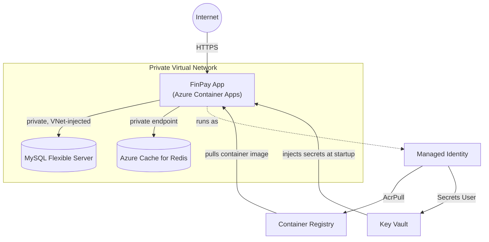

# FinPay Azure Infrastructure

Terraform-managed Azure infrastructure for **FinPay**, a fintech application. This repo
provisions everything the app runs on — network, database, cache, secrets, container
registry, and compute — as code, with private networking and managed identities used
throughout instead of public endpoints or stored credentials.

## Architecture

The app is only reachable over HTTPS; the database and cache have no public endpoint at
all, and the app authenticates to the registry and Key Vault as itself, with no stored
credentials anywhere.



## What's built

**Networking** — A private virtual network split into dedicated subnets for compute, the
database, and private endpoints, with private DNS zones so internal services resolve each
other without ever needing a public IP.

**Database** — Azure Database for MySQL (Flexible Server), deployed entirely inside the
private network with automated backups and auto-growing storage.

**Cache** — Azure Cache for Redis, reachable only through a private endpoint on the
internal network.

**Secrets management** — Azure Key Vault with role-based access control. The application
never handles a raw connection string or a hardcoded credential — secrets are injected at
runtime.

**Container registry & identity** — Azure Container Registry paired with a user-assigned
managed identity, so the app pulls its own container image and reads its own secrets
without any stored username/password anywhere in the stack.

**Compute** — Azure Container Apps, running inside the same private network, scaling
automatically between a configurable minimum and maximum number of replicas.

**Remote state** — Terraform state is stored remotely in Azure Storage rather than on a
local machine, set up via a small one-time bootstrap step, so infrastructure changes are
tracked and can be safely applied by more than one person.

## Tech stack

Terraform (HCL) · Microsoft Azure — Container Apps, Database for MySQL, Cache for Redis,
Key Vault, Container Registry, Virtual Network

## Project structure

```
.
├── main.tf, variables.tf, outputs.tf   # root module — wires everything together
├── modules/
│   ├── networking/                     # VNet, subnets, private DNS
│   ├── database/                       # MySQL Flexible Server
│   ├── cache/                          # Redis
│   ├── keyvault/                       # secrets
│   ├── registry/                       # container registry + managed identity
│   └── container_app/                  # the running application
├── environments/                       # per-environment backend configs (dev, prod)
└── bootstrap/                          # one-time setup of remote Terraform state
```

## Documentation

Full docs live in [docs/](docs/)

- New to this repo? Start with the [tutorial](docs/tutorials/deploy-dev-environment.md).
- Doing a specific task? See the [how-to guides](docs/how-to/).
- Looking up exact module inputs/outputs? See [reference](docs/reference/).
- Curious about a design decision? See [explanation](docs/explanation/).
